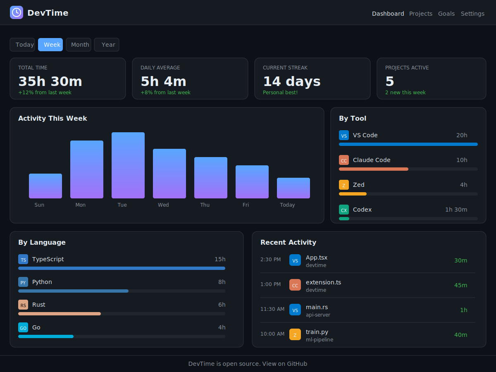

# DevTime

Open-source developer activity tracking across VSCode, Claude Code, Codex, Zed, and more.



## Why?

Track how much time you spend coding across different tools and projects. Like WakaTime, but open-source and self-hostable.

## Features

- **Multi-tool tracking**: VSCode, Claude Code, Codex CLI, Zed
- **Self-hostable**: Deploy on Cloudflare Workers + PlanetScale for ~$0/month
- **Privacy-first**: Your data stays on your infrastructure
- **Simple dashboard**: Daily/weekly/monthly breakdowns by tool, project, and language
- **Offline support**: Heartbeats are queued and sent when connection is restored

## Screenshots

### Dashboard Overview
The dashboard shows your coding activity at a glance:
- **Total time** tracked this week/month
- **Daily activity** bar chart
- **Breakdown by tool** (VS Code, Claude Code, Zed, Codex)
- **Breakdown by language** (TypeScript, Python, Rust, Go, etc.)
- **Recent activity** feed
- **Top projects** with time spent


## Architecture

```
┌──────────────────────────────────────────────────────────┐
│                      Plugins                              │
│  VSCode  │  Claude Code  │  Codex CLI  │  Zed            │
└──────────────────────────────────────────────────────────┘
                           │
                           ▼ Heartbeats (HTTPS)
┌──────────────────────────────────────────────────────────┐
│              API (Cloudflare Workers)                     │
└──────────────────────────────────────────────────────────┘
                           │
                           ▼
┌──────────────────────────────────────────────────────────┐
│              Database (PlanetScale)                       │
└──────────────────────────────────────────────────────────┘
                           │
                           ▼
┌──────────────────────────────────────────────────────────┐
│              Dashboard (Cloudflare Pages)                 │
└──────────────────────────────────────────────────────────┘
```

## Plugins

### VSCode Extension

The VSCode extension tracks your coding activity automatically:

- Tracks file opens, edits, and saves
- Detects programming language automatically
- Tracks debugging sessions separately
- Shows time in status bar
- Batches heartbeats to reduce network usage

**Installation:**
```bash
# From source
cd packages/plugins/vscode
pnpm install
pnpm build
# Then install the .vsix file
```

**Configuration:**
```json
{
  "devtime.enabled": true,
  "devtime.apiEndpoint": "https://your-api.example.com",
  "devtime.apiKey": "your-api-key",
  "devtime.heartbeatInterval": 120
}
```

### Claude Code

Uses Claude Code's hook system to track AI coding sessions.

**Installation:**
```bash
cd packages/plugins/claude-code
pnpm install
pnpm build

# Install hooks into Claude Code
node dist/cli.js install

# Configure API endpoint
node dist/cli.js config --endpoint https://api.devtime.dev --key dt_xxx
```

**What it tracks:**
- SessionStart/SessionEnd for session duration
- Tool usage (Bash, Read, Write, Edit, Glob, Grep)
- Project context from working directory
- File and language detection

**How it works:**
1. Hooks are added to `~/.claude/settings.json`
2. Each tool use triggers a heartbeat
3. Heartbeats are queued locally in `~/.devtime/heartbeat-queue.json`
4. Queue is flushed to API on session end (or manually with `flush` command)

**Commands:**
```bash
devtime-claude install     # Install hooks
devtime-claude uninstall   # Remove hooks
devtime-claude config      # Configure API
devtime-claude flush       # Manually flush queue
```

### Codex CLI (Coming Soon)

Wraps Codex CLI to track AI-assisted coding:
- Uses OpenTelemetry integration
- Tracks session duration and commands

### Zed (Coming Soon)

Language server approach for Zed editor:
- Registers as LSP to receive edit events
- Similar to WakaTime's approach

## Project Structure

```
packages/
├── shared/           # Zod schemas and utilities shared across all packages
├── api/              # Cloudflare Workers API (Hono)
├── dashboard/        # React dashboard (Vite + Tailwind CSS)
└── plugins/
    ├── vscode/       # VSCode extension
    └── claude-code/  # Claude Code hook-based plugin
```

## API

The API is built on Cloudflare Workers using Hono. All routes are versioned (`/v1/...`).

### Endpoints

#### `POST /v1/heartbeat`

Send a single heartbeat.

```bash
curl -X POST https://api.devtime.dev/v1/heartbeat \
  -H "Content-Type: application/json" \
  -H "Authorization: Bearer dt_your_api_key" \
  -d '{
    "tool": "vscode",
    "timestamp": 1705600000000,
    "activity_type": "coding",
    "project": "my-project",
    "file": "index.ts",
    "language": "typescript"
  }'
```

#### `POST /v1/heartbeat/batch`

Send multiple heartbeats at once (recommended for plugins).

```bash
curl -X POST https://api.devtime.dev/v1/heartbeat/batch \
  -H "Content-Type: application/json" \
  -H "Authorization: Bearer dt_your_api_key" \
  -d '{
    "heartbeats": [
      { "tool": "vscode", "timestamp": 1705600000000, "activity_type": "coding", ... },
      { "tool": "vscode", "timestamp": 1705600030000, "activity_type": "coding", ... }
    ]
  }'
```

#### `GET /v1/stats`

Get aggregated statistics.

```bash
curl https://api.devtime.dev/v1/stats?range=week \
  -H "Authorization: Bearer dt_your_api_key"
```

Query parameters:
- `range`: `today`, `week`, `month`, or `year` (default: `week`)
- `project`: Filter by project name
- `tool`: Filter by tool name

Response:
```json
{
  "total_seconds": 127800,
  "by_tool": { "vscode": 72000, "claude-code": 36000 },
  "by_project": { "devtime": 43200, "api-server": 28800 },
  "by_language": { "typescript": 54000, "python": 28800 },
  "by_day": [
    { "date": "2025-01-18", "seconds": 14400 }
  ]
}
```

### Heartbeat Schema

| Field | Type | Required | Description |
|-------|------|----------|-------------|
| `tool` | string | Yes | Tool identifier (`vscode`, `claude-code`, `codex`, `zed`) |
| `timestamp` | number | Yes | Unix timestamp in milliseconds |
| `activity_type` | string | Yes | Activity type (`coding`, `debugging`, `prompting`, `browsing`) |
| `project` | string | No | Project/workspace name |
| `file` | string | No | File name (not full path) |
| `language` | string | No | Programming language |
| `branch` | string | No | Git branch name |
| `machine_id` | string | No | Machine identifier for multi-device tracking |
| `is_write` | boolean | No | Whether this was a write operation |
| `lines` | number | No | Total lines in file |
| `cursor_line` | number | No | Current cursor line |

### API Deployment

```bash
cd packages/api

# Local development
pnpm dev

# Deploy to Cloudflare
pnpm deploy
```

Configure Cloudflare secrets:
```bash
wrangler secret put API_KEYS  # KV namespace binding
```

## Development

```bash
# Install dependencies
pnpm install

# Build all packages
pnpm build

# Run all tests
pnpm test

# Build specific package
pnpm --filter @devtime/shared build
pnpm --filter @devtime/api build
pnpm --filter @devtime/dashboard build
pnpm --filter devtime-vscode build

# Run API locally
pnpm --filter @devtime/api dev

# Run dashboard locally
pnpm --filter @devtime/dashboard dev

# Preview dashboard build
pnpm --filter @devtime/dashboard preview
```

### Running E2E Tests

The dashboard includes Playwright end-to-end tests that verify the full flow from sending heartbeats to displaying data in the UI.

```bash
# Install Playwright browsers (first time only)
pnpm --filter @devtime/dashboard exec playwright install chromium

# Run e2e tests (starts API and dashboard automatically)
pnpm --filter @devtime/dashboard test:e2e

# Run e2e tests with UI mode for debugging
pnpm --filter @devtime/dashboard test:e2e:ui
```

The e2e tests will automatically:
1. Start the API server on port 8787
2. Start the dashboard dev server on port 5173
3. Run tests that send heartbeats and verify the UI displays correct data

## Hosting

### Recommended Stack (Free Tier)

| Service | Purpose | Free Tier |
|---------|---------|-----------|
| **Cloudflare Workers** | API | 100K req/day |
| **Cloudflare D1** | Database | 5M reads/day, 100K writes/day |
| **Cloudflare KV** | API key storage | 100K reads/day |
| **Cloudflare Pages** | Dashboard | Unlimited |

**Total cost: $0/month** for personal use

### Cloudflare Setup

1. Create a D1 database:
```bash
wrangler d1 create devtime-db
```

2. Create KV namespaces:
```bash
wrangler kv:namespace create API_KEYS
wrangler kv:namespace create HEARTBEATS
```

3. Update `wrangler.toml` with the binding IDs

4. Deploy:
```bash
pnpm --filter @devtime/api deploy
```

## Configuration

All plugins read from `~/.devtime/config.toml`:

```toml
[api]
endpoint = "https://api.devtime.dev"
key = "dt_xxxxxxxxxxxxxxxxxxxx"

[privacy]
anonymize_file_paths = false
exclude_projects = ["secret-work"]
exclude_file_patterns = ["*.env", "*.secret"]

[tracking]
idle_timeout_minutes = 15
heartbeat_interval_seconds = 120
```

## Privacy

- **No code content** is ever sent, only metadata (filename, language, line count)
- **File paths** can be anonymized/hashed
- **Exclude patterns** for sensitive projects
- **Self-hosted** option keeps all data on your infrastructure

## Contributing

Contributions are welcome! Please read the [PLAN.md](PLAN.md) for the implementation roadmap.

## License

MIT
